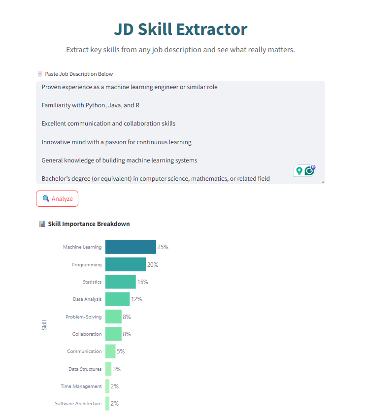

# 🔥 JD Skill Extractor

**JD Skill Extractor** is a Streamlit-based web application that uses a powerful LLM (via Groq API) to extract **key skills** from any job description and assigns an **importance score** to each. It helps job seekers, recruiters, and HR teams quickly understand the essential requirements for any role.




## 🚀 Features

- LLM-powered skill extraction (via Groq API)
- Interactive bar chart visualization of skill importance
- Clean, responsive UI with modern styling
- Paste job description and analyze instantly
- JSON output with importance score totaling 100


## ⚙️ Installation

1. **Clone the repository**:

```
git clone https://github.com/lintosunny/jd-skill-extractor.git
```

2. **Create and activate a virtual environment (optional but recommended)**:

```
conda create -n env python=3.10 -y
```

```
conda activate env
```

3. **Install Dependencies**:

```
pip install -r requirements.txt
```

4. **Setup your API Key**:

Create a ```.env``` file in the root directory and add your Groq API key:

```
API_KEY=your_groq_api_key_here
```

5. **Run the App**
```
streamlit run app.py
```
Once started app will be open in your default web browser.


## 💡 How It Works

- You paste a job description in the provided input area.
- The app sends the text to a **Groq-powered LLM** with a tailored prompt.
- The LLM returns a **JSON response** with each skill and its importance.
- The response is visualized using a **horizontal bar chart** via Plotly.


## 🛠️ Future Enhancements

- CSV download for extracted skills  
- Resume matching feature  
- Multiple JD comparison  
- Skill category classification


## 🤝 Contributing

Contributions are welcome! Feel free to open issues or submit pull requests to enhance the project.


## 📄 License

This project is open-source and available under the **MIT License**.


## 🙋‍♂️ Author

**Linto Sunny** • [LinkedIn](https://linkedin.com/in/lintons) • [GitHub](https://github.com/lintosunny)
